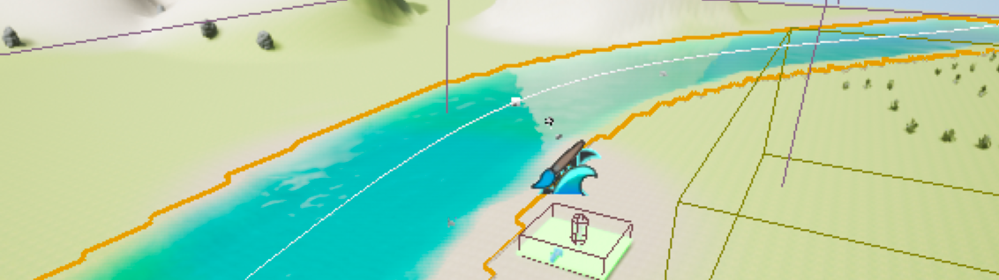

项目传送门：https://github.com/WillKen/SceneDemo

视频演示：[MyScene｜游戏Demo演示-哔哩哔哩](https://b23.tv/C608VlS)

# 开发环境

操作系统：macOS Monterey 12.5 （MacBook pro M1）

游戏引擎：UE4.27.2

# 场景设计简介

## 场景划分

|                             山区                             |                            灌木区                            |
| :----------------------------------------------------------: | :----------------------------------------------------------: |
|  |  |
|                        **异种树林区**                        |                          **河流区**                          |
|  |  |

## 动态更改材质

|            当角色站在平台上，平台发绿光且进行旋转            |           当角色不在平台上，平台发橙色光且保持静止           |
| :----------------------------------------------------------: | :----------------------------------------------------------: |
|  |  |

## 动态光源

设计了平行光，并模拟太阳运动，使地面上物体产生不同的阴影。

|  |  |
| ------------------------------------------------------------ | ------------------------------------------------------------ |

## PostProcessVolume

在山区是淡黄色场景颜色，渲染出秋季的氛围。

在灌木区设计了浅绿色场景颜色，渲染出春季的氛围。

在异种树林区设计了浅蓝色场景颜色，并设置了颗粒抖动，渲染出冬季氛围。

